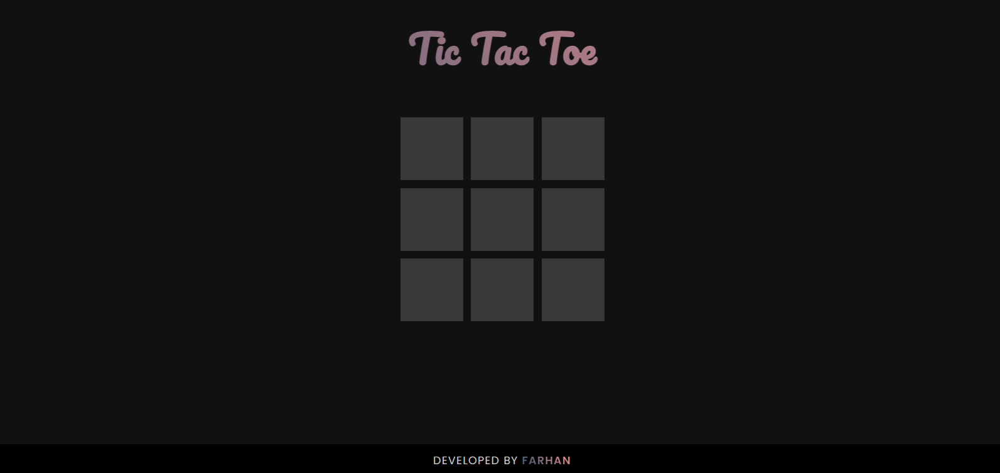

# Tic Tac Toe Game
This is a Tic Tac Toe game created with HTML, CSS, and JavaScript. It is a two-player game, where each player takes turns marking a square on a 3x3 grid until one player gets three in a row (horizontally, vertically, or diagonally) or all nine squares are filled.

## Preview

## Demo
You can see a live demo of the Tic Tac Toe game [here](https://f-tictactoe.netlify.app/).

## Usage
To play the Tic Tac Toe game, simply click on a square on the grid to mark it with an "X" or "O". Players take turns marking squares until one player wins or all squares are filled.

## Credits
This Tic Tac Toe game was created by Farhan.